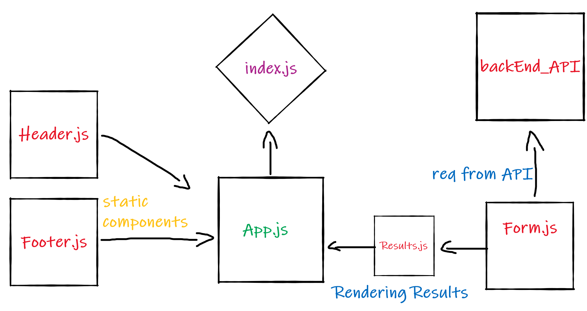

# RESTy

### Author : Hatem Husnieh

## install

1. copy the link of the repo
1. clone the repo on your local machine by `git clone repo-url`
1. download independencies by `npm i`
1. run the app

## Deploy, Run and Test

- [Pull Request](https://github.com/IbrahimAbuawad/counter/pull/1)
- [SandBox]()

### Setup

#### `.env` requirement

- `PORT` - port number
- `MONGODB_URL` - port number
- `SECRET` - a random secret for encryption

#### Running the app

- either:
  1. `npm start`

### UML:

